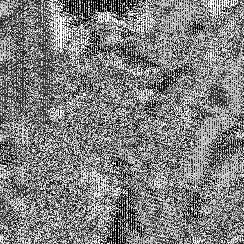
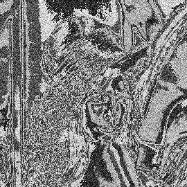
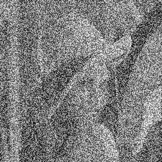
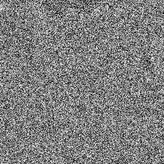

# Scalar Processor
Simulation of a Scalar processor using GoLang.

## Introduction

Scalar processors are a class of computer processors that process only one data item at a time. It is to be contrasted with a vector processor where a single instruction operates simultaneously on multiple data items (and thus is referred to as a single instruction, multiple data (SIMD) processor). The difference is analogous to the difference between scalar and vector arithmetic.  [[1]](https://en.wikipedia.org/wiki/Scalar_processor)

In comparassion, a superscalar processor (such as the Intel P5) may execute more than one instruction during a clock cycle by simultaneously dispatching multiple instructions to redundant functional units on the processor.


## Methods
### Processor
The designed processor in this project is pipelined and has 5 stages: Fetch (IF), Decode(ID), Execute(EX), Memory(MEM) and WriteBack(WB)
The processor is based in ARM and is capable of: adding (ADDI), loading into memory (LOAD), storing (STORE), and doing custom operations.
Custom operations are:
- XOR Encriptation (XOR255)
- Shuffling bits (SHUFFLE)
- Unshuffling bits (UNSHUFFLE)
- Flipping bits (FLIP)
- Rotating left and right (RL) and (RR)

Take a look at the ALU implementation [here](https://github.com/paroque28/scalarProcessorInGOLang/blob/master/cpu/alu.go#L20)

### Assembly language
This project contains a custom Assembly file that can be read by the designed processor.

Take a look at the following code:
```
// Add Skip size of image
ADDI V2 V2 #4
#repeat 9256
LOAD V5 V2
// XOR Encriptation
XOR255 V5 V5 #170
XOR255 V5 V5 #170
STORE V2 V5
ADDI V2 V2 #8
#endrepeat
```
Note: the Repeat Macro is used as a loop unrolling to about branching (Not implemented yet).

This code encrypts an image using the XOR method.

## Results:

Using Lenna as an input:


)

### XOR 

)
### SHUFFLE 

)
### SHUFFLE255 

)
### Rotate right

)
### Rotate left 

)
### Flip 

)
### ADD 

)

## Conclusion

Simulationg an scalar processor using GoLang was a success, it was very easy to prototype because of the language structure and access to bitwise operations.
From the image encryption perspective, the best result was acquired by the shuffle command which obfuscated the data perfectly. If we were to have this custom processor, it would be very cheap and efficient to encrypt images using the SHUFFLE instruction.
